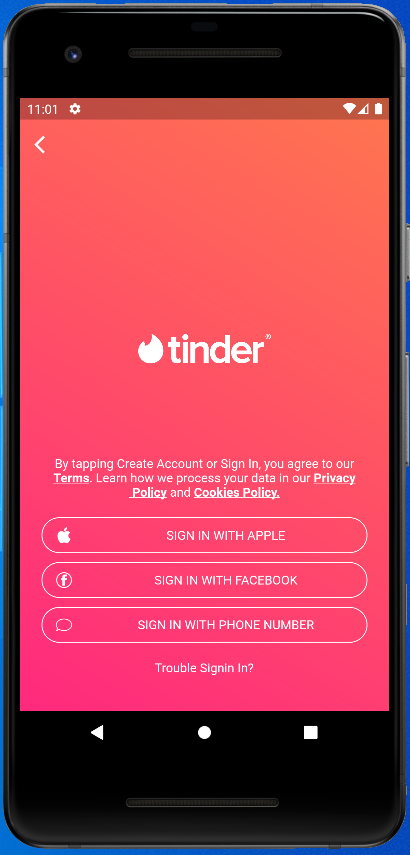

# tinder_login

Login challenge made in the second class of the masterclass flutterando.

Course link: https://masterclass.flutterando.com.br/public/products/8f64d9b5-e1fb-4cf0-86a0-2e04c4580a5b

## Getting Started

This project is a starting point for a Flutter application.

A few resources to get you started if this is your first Flutter project:

- [Lab: Write your first Flutter app](https://flutter.dev/docs/get-started/codelab)
- [Cookbook: Useful Flutter samples](https://flutter.dev/docs/cookbook)

For help getting started with Flutter, view our
[online documentation](https://flutter.dev/docs), which offers tutorials,
samples, guidance on mobile development, and a full API reference.

<h2 align="center">Layout 🎨</h2>

   <p align="center">
      
   </p>

---

<h2 align="center">How to Use 🤔</h2>

   ```
   - Download or clone this repo by using the link below::
   $ git clone https://github.com/rondonVitor/tinder_login.git

   - Enter directory:
   $ cd tinder_Login

   - Go to project root and execute the following command in console to get the required dependencies:
   $ flutter pub get

   - Run the app: 
   $ flutter run
   ```

---